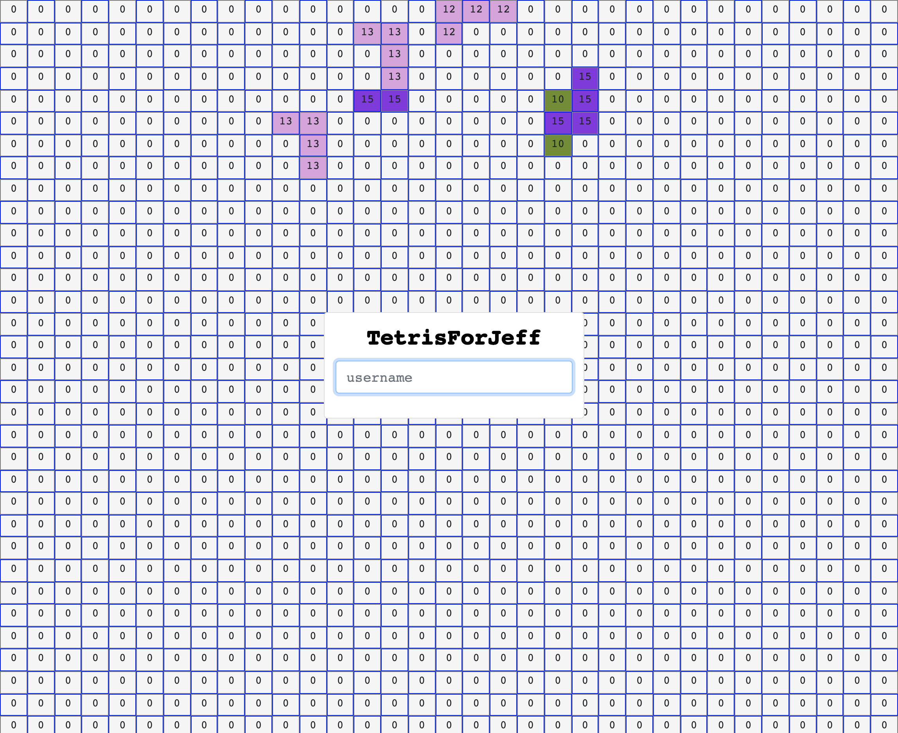

# Red Tetris

### Assignment

Le projet doit être écrit totalement en Javascript et particulièrement dans sa version
es2015 (ES6).
Le code client (navigateur) doit être écrit sans appel à "this" dans le but de vous
pousser à utiliser des constructions fonctionnelles et non objet. Vous avez le choix de la
librairie fonctionnelle (lodash, ramda, ...) à utiliser ou pas. La logique de manipulation
du tas et des pièces doit être implémentée sous forme de "pure functions". Une exception à cette règle : "this" peut être utilisé pour définir ses propres sous classes d’"Error".

L’application client doit être construite à partir des librairies React et Redux.

Le code HTML ne doit pas utiliser d’éléments "TABLE", mais doit être exclusivement construit à partir d’un layout flexbox.

Interdiction d’utiliser :
• Une librairie de manipulation du DOM comme jQuery
• Des canvas
• Du SVG (Scalable Vector Graphics)

Clients et serveur communiquent via socket.io, nous vous demandons d’utiliser un
middleware Redux pour gérer l’envoi et la réception des messages. Une première version,
qu’il vous faudra adapter, est disponible dans le boilerplate.

### Install

```
$ npm install
```

### Development Mode

#### Launch Server

```
$ npm run  srv-dev

```

#### Launch Client

```
$ npm run client-dev
```

#### Test

```
$ npm run test
```

```
$ npm run coverage
```


